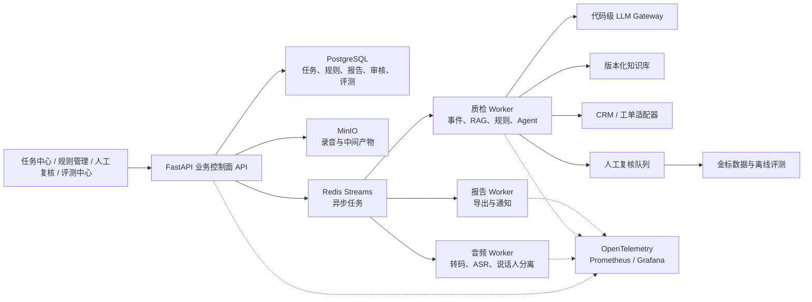
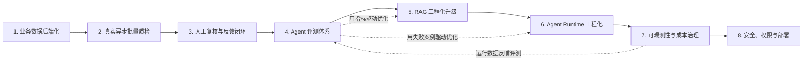
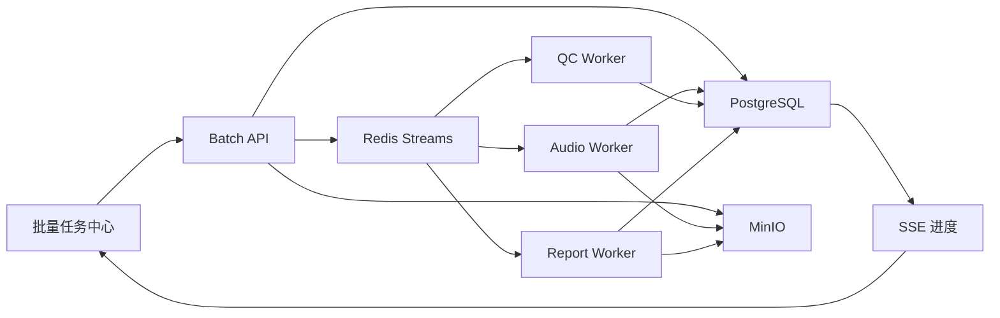
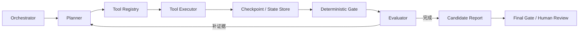

# 客服质检 Agent 项目工程化升级路线图

> 文档状态：规划中。未实施的能力不得写入简历或 README 的“已完成功能”。  
> 项目目标：把当前可信单机 POC 逐步升级为能够体现大模型应用开发、Agent 工程化和后端工程能力的求职项目。  
> 实施原则：按依赖关系逐阶段建设；每一阶段都必须形成可运行、可测试、可讲解的成果；不为堆栈而同时引入多套同类组件。

---

## 1. 当前基础与目标架构

### 1.1 当前已经具备

- Flask 单通话质检 API；
- Pydantic 请求、报告、状态和结构化错误；
- DeepSeek 结构化事件提取和代码级 LLM Gateway；
- 后端稳定 `eventId`；
- 本地 RAG、规则有效期、确定性扣分和 `QualityGate`；
- Direct 路径与有界 Agent Loop；
- Loop 内 Planner、Executor 和 Evaluator；
- `RUNNING/COMPLETED/PARTIAL/FAILED` 状态机；
- SQLite 运行记录；
- 离线测试和真实 RAG、DeepSeek、FunASR 测试入口；
- 批次、文件、阶段状态、幂等键、恢复候选和导出等批量骨架。

### 1.2 当前主要缺口

- 前端案件、规则和部分历史结果仍主要来自硬编码数据；
- 单通话、批量、规则、知识和审核尚未进入统一业务数据库；
- 批量 CLI 仍注入 `FakeAudioStageRunner`；
- 没有正式人工复核工作流和反馈闭环；
- 没有系统化 LLM/RAG/Agent 评测平台；
- RAG 缺少知识库构建、发布、回滚和历史证据快照；
- Agent 缺少持久化 Checkpoint、全局 Deadline 和完整预算；
- 没有统一日志、指标、Trace 和成本账本；
- 没有登录、RBAC、安全审计和完整部署方案。

### 1.3 目标架构



目标是一台机器即可完整演示的多服务平台，不把 Kubernetes、多租户、独立 AI 中台等高成本能力列为必做项。

---

## 2. 八个阶段及顺序



顺序依据：

1. 先建立后端唯一事实源，否则批量、审核和评测仍会读取多套数据；
2. 再把可信单通话链路接入真实异步批量；
3. 有真实任务后建设人工复核，开始积累反馈；
4. 有反馈和版本数据后建设评测，才能判断后续优化是否有效；
5. 用评测结果指导 RAG 和 Agent Runtime，而不是凭感觉增加复杂度；
6. 核心链路稳定后建设完整可观测性和成本治理；
7. 最后收拢认证、权限、部署、恢复和交付能力。

安全底线、超时、运行标识和基础限流从早期阶段开始预留，第 7、8 阶段再完善成体系。

---

## 3. 八阶段前置工作：修正批量骨架

这不是第九阶段，而是进入真实批量前必须完成的正确性修复。

### 3.1 需要修正

- 已标记完成的阶段不能再次执行实际 action；
- 单通话 `FAILED` 或 `report=None` 必须失败关闭，不能进入批量 `DONE`；
- 阶段枚举、实际执行和阶段记录保持一致；
- 重试次数归属真实失败阶段，不能全部记录为 QC；
- 阶段恢复必须复用已保存产物，而不只是读取状态字符串。

### 3.2 阶段产物

```text
TRANSCODE -> wavObjectKey / wavHash
ASR       -> transcriptId / transcriptVersion
EVENT     -> eventSnapshotId
RAG       -> retrievalSnapshotId / knowledgeVersion
QC        -> qcRunId / reportId
EXPORT    -> exportObjectKey
```

### 3.3 前置验收

- `FAILED/report=None` 不可能进入 `DONE`；
- 中断后从最近成功且产物有效的阶段继续；
- 已完成 ASR 的文件恢复时不会再次调用 ASR；
- 错误和尝试次数记录在真实失败阶段；
- 同一文件重复摄取不会生成重复任务；
- 现有离线批量测试继续通过。

---

# 第一阶段：业务数据后端化与前后端一致性

## 4. 目标

先把现有 Flask API 迁移为 FastAPI，再把后端数据库建设成案件、通话、规则、报告、审核和运行状态的唯一事实源，前端不再维护硬编码的权威业务数据。第二阶段及之后新增的接口全部直接基于 FastAPI 开发，不再继续扩展 Flask。

## 5. 技术栈

```text
FastAPI + Uvicorn + Pydantic + SQLAlchemy 2.x AsyncSession
asyncpg + Alembic + PostgreSQL + MinIO + pytest
```

本阶段把现有 Flask API 迁移到 FastAPI。迁移目的不是简单替换 Web 框架，而是建立明确的 API 契约、依赖注入、生命周期管理和异步 I/O 边界。关系数据库选择 PostgreSQL，不同时维护 MySQL。

这里的异步选择依据是任务性质，而不是单纯看任务是否耗时：

- LLM HTTP 调用、PostgreSQL、Redis 和对象存储等 I/O 等待型操作，适合使用异步客户端和 `await`；
- FunASR、音频转码和说话人分离等 CPU/GPU 或阻塞型操作，交给独立 Worker；
- 需要可靠执行、重试和恢复的长流程，写入任务表并投递 Redis Streams，不能只依赖 API 进程内异步。

`AsyncSession + asyncpg` 不是 FastAPI 或异步 LLM 的强制依赖。本路线选择它们，是因为第一阶段同时引入 PostgreSQL，后续会存在大量任务状态查询、SSE 和人工复核等并发数据库 I/O；如果实施时基准测试表明同步数据库访问已经足够，也可以保留同步 SQLAlchemy，但不得在 `async def` 中直接运行会长期阻塞 Event Loop 的同步数据库调用。

### 5.1 第一阶段内部顺序

1. 用契约测试固定需要保留的现有接口行为；
2. 抽离路由中的业务逻辑，完成 Flask 到 FastAPI 的迁移；
3. 确认 FastAPI 成为唯一 Web API 入口；
4. 再建设 PostgreSQL、MinIO 和新的业务数据 API；
5. 第一阶段结束后移除 Flask 运行依赖，后续阶段不再产生新的 Flask 路由。

### 5.2 FastAPI 迁移方案

迁移按以下顺序进行：

1. 先用接口契约测试固定现有 Flask API 的请求、响应、状态码和错误结构；
2. 把质检编排、状态转换、规则判断和持久化逻辑从 Flask 路由中抽到独立 Service/Application 层；
3. 新建 FastAPI 应用，用 Pydantic 定义请求和响应模型，并补齐统一异常处理和依赖注入；
4. 使用 SQLAlchemy 2.x `AsyncSession` 和 `asyncpg` 访问 PostgreSQL，每个请求使用独立 Session；
5. LLM 等网络调用提供真正的异步接口，复用异步 HTTP Client 及连接池，并设置 timeout、deadline 和有限重试；
6. 逐个迁移路由并运行新旧契约对照测试；所有入口迁移完成后再移除 Flask 启动入口。

迁移期间不能只把 `def` 改成 `async def`。如果函数内部仍调用同步 HTTP、同步数据库或阻塞 SDK，它仍会阻塞 Event Loop。暂时无法替换的同步调用必须明确隔离在线程池或 Worker 中，不能伪装成异步实现。

### 5.3 异步边界

FastAPI 负责高并发、短生命周期的控制面请求：

- 查询案件、报告、任务状态和规则；
- 创建单通话或批量质检任务；
- 上传元数据、鉴权、分页和 SSE 连接；
- 对确实需要同步返回结果且耗时可控的单次 LLM 调用进行 `await`。

以下工作不能在 API Event Loop 中直接执行：

- 音频转码、FunASR、说话人分离等 CPU/GPU 或阻塞任务；
- 整批音频的事件提取、RAG、规则和 Agent 链路；
- 长时间导出和通知任务；
- 无法保证在接口超时内完成的 LLM 调用。

这些任务由 API 写入数据库并投递到 Redis Streams，接口返回 `202 Accepted + runId/batchId`，再由 Worker 执行。FastAPI `BackgroundTasks` 只适合进程内、允许丢失的轻量收尾工作，不能代替可靠消息队列。

实时 LLM 调用与 Worker 内 LLM 调用都必须有并发上限，不能因为使用 `asyncio.gather` 就无限并发。并发数、请求速率、Token 预算、超时和重试共同受控。

## 6. 数据模型

### 6.1 案件、通话和音频

```text
cases
calls
audio_assets
transcripts
transcript_turns
```

- `cases`：案件业务元数据；
- `calls`：通话和真实通话时间；
- `audio_assets`：原音频与派生产物元数据；
- `transcripts`：ASR 结果、模型和版本；
- `transcript_turns`：标准化说话人、文本和时间戳。

### 6.2 运行和报告

```text
qc_runs
qc_events
qc_reports
qc_violations
qc_evidences
qc_errors
agent_trace_events
```

要求：

- 同一通话允许多次运行；
- 新运行不能覆盖历史运行；
- 当前生效报告与历史报告分开；
- 报告可反查模型、Prompt、规则集和知识库版本；
- 事件、违规、证据和错误具有明确关联。

### 6.3 规则与知识版本

```text
rule_sets
rule_versions
rules
knowledge_bases
knowledge_versions
knowledge_documents
```

规则集和知识库至少支持：

```text
DRAFT -> PUBLISHED -> RETIRED
```

发布版本不可原地修改；修改必须创建新版本，历史报告继续引用旧版本。

## 7. 对象存储

MinIO 保存原音频、WAV、ASR 原始输出、转写快照和导出文件。PostgreSQL 只保存：

```text
objectKey / sha256 / size / mimeType / assetType / createdAt / retentionPolicy
```

不把大音频直接存入关系数据库。

## 8. API 与前端

至少增加：

```text
GET  /api/cases
GET  /api/cases/{caseId}
GET  /api/calls/{callId}
GET  /api/calls/{callId}/transcript
GET  /api/calls/{callId}/runs
GET  /api/runs/{runId}
GET  /api/reports/{reportId}

GET  /api/rule-sets
POST /api/rule-sets
POST /api/rule-sets/{ruleSetId}/publish

POST /api/audio-assets
GET  /api/audio-assets/{assetId}
```

列表接口支持分页、排序、时间/状态/坐席/规则筛选和最大 `pageSize`。

前端逐步删除：

- `MOCK_DATA`；
- 前端内存规则；
- 伪造的历史报告；
- 未请求后端却显示“保存成功”的操作。

前端只展示后端状态，不自行决定规则有效性、权威扣分或质检终态。

## 9. 基础保护

- 请求体和上传文件大小限制；
- 分页上限；
- 数据库连接池上限；
- 接口超时和统一错误响应；
- 基础 IP/接口频率保护；
- 文件 MIME、扩展名和哈希校验。

## 10. 验收

- 页面刷新后数据不丢失；
- 前端权威业务数据全部来自 API；
- 修改规则不会改变历史报告；
- 同一通话多次运行可分别查询；
- 音频和派生产物进入对象存储；
- Alembic 可验证空库初始化和旧版本升级；
- FastAPI 成为唯一 Web API 启动入口，Flask 接口契约迁移后保持兼容；
- OpenAPI Schema 可生成，并通过请求、响应和错误结构的契约测试；
- 使用 Fake 异步上游的并发测试证明 LLM 等网络等待不会串行阻塞 Event Loop；
- 阻塞式 ASR、转码和批处理不会运行在 API Event Loop；
- 应用启动和关闭时能够正确创建、复用并释放数据库及 HTTP 连接池；
- 核心 API 有契约、分页和异常测试。

## 11. 技术体现

FastAPI、ASGI、async/await、Pydantic、OpenAPI、依赖注入、PostgreSQL 领域建模、SQLAlchemy AsyncSession、asyncpg、Alembic、事务、索引、版本化、MinIO/S3、前后端一致性。

---

# 第二阶段：真实异步批量质检平台

## 12. 目标

把 Fake 批量骨架升级为真实音频和真实质检链路驱动的异步平台。FastAPI 创建批次、持久化任务并投递消息后，立即返回 `202 Accepted + batchId`；后台 Worker 执行任务，前端持续查看进度和结果。

## 13. 技术栈与架构

```text
FastAPI：任务创建、查询、取消和 SSE 控制面
PostgreSQL：任务唯一事实源
Redis Streams：消息队列和 Consumer Group
MinIO：音频和阶段产物
Audio Worker / QC Worker / Report Worker
SSE：进度推送
```

第一版只选 Redis Streams，不同时引入 RabbitMQ、Kafka 和 Celery。不要求 Kubernetes，也不建设独立 LLM Gateway 微服务。



## 14. Worker 职责

### Audio Worker

- 下载、格式和哈希校验；
- 转码、FunASR、说话人分离；
- 标准化 `TranscriptTurn`；
- 保存 WAV、转写、模型版本、耗时和错误；
- 模型在 Worker 进程常驻，不按文件重复加载。

### QC Worker

- 读取 transcript；
- 事件提取、RAG、规则、审计、Agent Loop；
- 最终 `QualityGate`；
- 保存运行和报告；
- DeepSeek 继续经过现有代码级 Gateway。

### Report Worker

- JSON/CSV/Excel/PDF 导出；
- 批次汇总和可选通知。

第一版可暂时合并 Report Worker，待导出明显影响主链路后再拆。

## 15. 三层状态

```text
Batch:
CREATED / QUEUED / RUNNING / PARTIAL / COMPLETED / FAILED / CANCELLED

BatchItem:
PENDING / RUNNING / HUMAN_REVIEW / DONE /
FAILED_RETRYABLE / FAILED_FINAL / CANCELLED

StageExecution:
PENDING / RUNNING / SUCCEEDED / FAILED / SKIPPED
```

状态转换由后端条件更新，前端无权直接修改。

## 16. 可靠性

### 幂等

- 创建批次支持 `Idempotency-Key`；
- 批次内文件唯一键；
- 消息重复消费不会产生第二份有效报告；
- 条件更新防止终态覆盖；
- 导出任务可安全重放。

### 重试、死信和恢复

- 只重试可恢复错误；
- 按真实阶段记录 attempts；
- 有上限的指数退避；
- 重试耗尽进入失败终态和死信处理列表；
- 坏文件不阻塞其他文件；
- 支持单独重跑失败文件；
- Worker 重启后重新认领未完成消息；
- 已完成高成本阶段复用产物。

### Transactional Outbox

```text
同一 PostgreSQL 事务：
  INSERT batch
  INSERT batch_items
  INSERT outbox_events

Publisher：
  读取未发布 outbox
  -> 发送 Redis Streams
  -> 标记 published
```

避免数据库写入成功但消息丢失。

## 17. 限流、并发和背压

- 单批次最大文件数和总大小；
- 同时运行批次数；
- 队列积压上限；
- 转码 CPU 并发；
- ASR GPU 并发；
- QC Worker 并发；
- LLM 请求启动间隔；
- 最大重试次数；
- 批次成本预警。

第一版使用固定 Worker 数、本地 Semaphore、队列等待和 Provider 429 有限重试；暂不做 Redis Lua 分布式 RPM/TPM 令牌桶。

## 18. API 与页面

```text
POST /api/batches
GET  /api/batches
GET  /api/batches/{batchId}
GET  /api/batches/{batchId}/items
POST /api/batches/{batchId}/cancel
POST /api/batches/{batchId}/resume
POST /api/batches/{batchId}/retry-failed
POST /api/batches/{batchId}/exports
GET  /api/batches/{batchId}/events
```

任务中心展示总数、各状态数量、当前阶段、队列等待、完成比例、失败原因、成本和操作入口。

## 19. 验收

- 创建 100 文件批次后 API 快速返回；
- 真实音频经过 Audio Worker 和 QC Worker；
- Worker 重启后任务继续；
- 重复消息只产生一份有效报告；
- 坏文件不影响其他文件；
- 已完成 ASR 不会重复执行；
- LLM 429 只重试对应阶段且有上限；
- 取消后未开始任务不再执行；
- GPU 并发不超过配置；
- 前端持续收到进度；
- 文件终态数量之和等于批次总数。

## 20. 技术体现

Redis Streams、Consumer Group、ACK、异步 Worker、Transactional Outbox、幂等消费、重试、死信、Checkpoint、故障恢复、并发控制、背压、SSE。

---

# 第三阶段：人工复核与反馈闭环

## 21. 目标

让不能安全自动落地的报告进入正式人工复核，并将人工修正转换为可治理、可审计、可用于评测的数据。

## 22. 四个角色的边界

| 角色 | 职责 | 不能做什么 |
|---|---|---|
| 主运行 Agent | 查询证据、调用工具、形成候选报告 | 改变权威规则和扣分 |
| 运行时 Evaluator | 检查遗漏和矛盾，要求重新规划 | 绕过 Gate 批准处罚 |
| `QualityGate` | 执行确定性不变量 | 凭空生成业务事实 |
| 人工审核员 | 确认、修改或驳回真实案件结果 | 删除模型原始输出和历史 |

运行时 Evaluator、离线 Judge 和人工审核是三个不同层次。

## 23. 复核队列与工作台

进入队列：

- `PARTIAL/HUMAN_REVIEW_REQUIRED`；
- Gate 失败、RAG 支持不足或规则冲突；
- 高风险规则；
- 自动通过/自动违规随机抽样；
- 用户申诉。

工作台展示音频、转写、事件、违规、规则版本、RAG 引用、外部证据、Agent 摘要、当前报告和历史审核。

审核操作：确认结果、改判规则、增删违规、修改证据、调整处置、退回重跑、标记 ASR/数据/规则问题。

## 24. 状态与并发

```text
PENDING -> CLAIMED -> IN_REVIEW -> SUBMITTED
                           -> ADJUDICATION_REQUIRED -> RESOLVED
```

实现任务领取/释放、租约、单人领取上限、提交幂等键、乐观锁、理由码、备注、前后快照和审计记录。

## 25. 反馈治理

人工修改不自动成为金标：

```text
人工审核 -> 质量抽检 -> 分歧仲裁 -> 脱敏
         -> 数据集版本化 -> 训练/评测候选
```

反馈分类：漏提/错提事件、规则误配、RAG 无关引用、证据错误、扣分错误、自动/人工路由错误和 ASR 问题。

## 26. 验收

- 所有人工状态自动生成复核任务；
- 同一任务只能被一个审核员有效提交；
- 并发提交不会静默覆盖；
- 原始报告和修订报告同时保留；
- 修订有结构化理由和审计；
- 可统计模型与人工分歧；
- 未确认数据不能进入正式金标；
- 自动结果支持抽样复核。

## 27. 技术体现

Human-in-the-loop、工作流状态机、乐观锁、租约、幂等提交、并发控制、审计、数据版本化、Agent/Gate/人工权限分离。

---

# 第四阶段：Agent 评测体系

## 28. 目标

建立能够比较模型、Prompt、规则、知识库和 Agent 版本的离线评测体系，让 RAG 和 Agent 优化由指标和失败案例驱动。

## 29. 版本固定

每次评测记录：

```text
codeCommit / datasetVersion / model / promptVersion
toolSchemaVersion / ruleSetVersion / knowledgeVersion
embeddingModel / retrievalConfig / runtimeConfig / createdAt
```

## 30. 四层评测

### 组件

- ASR：CER/WER、说话人准确率、时间戳偏差、空转写率；
- 事件：Precision/Recall/F1、类型和引用准确率、重复率、非法输出率；
- RAG：Recall@K、Hit@K、MRR、nDCG、支持证据准确率和错误引用率。

没有人工转写金标时，ASR 只能做结构验收，不能声称准确率。

### 报告

- 规则 ID exact match；
- 违规集合 P/R/F1；
- 分数、disposition 和 status 准确率；
- 引用有效率；
- Fail Open 次数；
- 人工复核召回率。

### Agent

- 任务成功率；
- 平均轮数和工具次数；
- 无效/重复工具调用率；
- 预算耗尽率；
- Planner/Evaluator 分歧率；
- Gate 通过率。

### 系统

- 端到端 P50/P95/P99；
- 单通话成本；
- 批量吞吐和队列等待；
- Worker 成功率；
- 重试放大率；
- 人工复核率和改判率。

## 31. 数据集与 Judge

```text
Dev Set / Regression / Challenge Set / Shadow Set / Holdout Set
```

同一批案例不能长期同时用于调参和最终效果证明。

评估 Agent 可以检查解释、自洽性、遗漏和引用矛盾，但不能决定权威规则、扣分、自动处罚和业务事实。主 Agent 与 Judge 同源时必须以确定性指标和人工金标校验，并计算 Judge 与人工一致率。

## 32. 平台功能与预算

- 数据集管理；
- 创建/取消评测；
- 选择版本组合；
- 指标和两版本 Diff；
- 错误案例浏览与重放；
- 并发、最大案例数、Token 和费用上限；
- 相同版本组合的结果复用。

## 33. 验收

- 任意结果可追溯完整版本；
- 可比较两个版本并定位退化案例；
- Judge 与人工一致率可计算；
- 指标下降可阻止发布；
- Fail Open 为 0；
- 评测数据与敏感业务数据隔离；
- 中断、skip 和未运行不计为通过。

## 34. 技术体现

LLM Eval、RAG Eval、Agent Eval、金标版本化、实验追踪、回归门禁、LLM-as-a-Judge 边界和统计分析。

---

# 第五阶段：RAG 工程化升级

## 35. 目标

把本地索引升级为可构建、评测、发布、回滚和追溯的知识库。所有升级必须在第四阶段的固定评测集上证明收益。

## 36. 生命周期与摄取

```text
DRAFT -> BUILDING -> READY -> PUBLISHED -> RETIRED
                     \-> FAILED
```

数据对象：知识库、版本、文档、文档版本、Chunk、索引构建和发布记录。

摄取流程：

```text
上传 -> 解析 -> 清洗 -> Chunk -> 元数据 -> Embedding
     -> 索引 -> 校准/回归 -> 发布
```

记录原文哈希、Chunk 策略、Embedding 模型、索引版本、生效时间、事件类型、规则关系、权限和错误。

## 37. 检索升级

按评测收益逐项加入：

1. Dense + BM25；
2. metadata 强过滤；
3. 引用去重；
4. Cross-Encoder reranker；
5. 动态 Top-K；
6. Query Rewrite；
7. 多路召回。

没有指标收益的复杂能力应删除。向量存储第一版使用 PostgreSQL + pgvector，不同时引入多个向量数据库。

## 38. 证据快照与资源隔离

引用保存：

```text
documentId / documentVersion / chunkId / sourceRange
retrievalScore / rerankScore / ruleRelation
knowledgeVersion / effectiveFrom / effectiveTo
```

历史报告读取历史快照，不能重新检索当前知识库冒充当时依据。

在线检索限制 Top-K、查询长度、候选数、reranker 并发、上下文和超时；离线建库限制并发、文档大小、Embedding Batch 和 CPU/GPU。两者资源隔离。

## 39. 验收

- 知识库可构建、评测、发布、回滚和退役；
- 历史报告可读取历史证据；
- metadata 过滤不能被 Rewrite 绕过；
- 使用相同评测集比较升级前后；
- 目标指标提升且错误引用不增加；
- 无合格证据仍转人工；
- 文档中的指令不能改变 Agent 权限；
- 在线查询不被离线建库拖垮。

## 40. 技术体现

知识库版本化、数据摄取 Pipeline、pgvector、Hybrid Search、reranker、metadata 过滤、证据治理、RAG Eval、Prompt Injection 防护和资源隔离。

---

# 第六阶段：Agent Runtime 工程化

## 41. 目标

把有限 Loop 升级成可持久化、恢复、预算、审计和重放的 Agent Runtime。重点是更可控，不是更自由。



## 42. 确定性与 Agent 边界

状态转换、规则有效期、扣分、数据库写入、权限和自动落地不变量保持确定性。Agent 只决定查询什么补充证据、是否重规划和如何组织候选解释。

Agent 无权创建规则、改变扣分、绕过 Gate 或把不确定事实写成确定事实。

## 43. Tool Registry

每个工具声明：

```text
name / version / inputSchema / outputSchema / permission
readOnly / hasSideEffect / timeout / retryPolicy
idempotencyPolicy / costLevel / dataScope
```

Planner 只能调用注册工具。读取和副作用工具分开，高风险工具需要授权。

## 44. Checkpoint、Deadline 与预算

持久化 run、step、plan、tool call、observation、evaluation、checkpoint 和结果。中断后从已提交 Checkpoint 继续。

三层时间限制：外部请求 timeout、逻辑调用 deadline、整个 run deadline。每次调用前使用：

```text
requestTimeout = min(stageTimeout, remainingRunTime)
```

每次 run 限制：轮数、工具调用、LLM 请求、输入/输出 Token、估算费用、总耗时和同参数重复调用。耗尽后转人工或失败，不能继续循环。

## 45. 代码级 LLM Gateway

保留现有统一调用入口并逐步增强：

- 统一 timeout、错误分类、有限重试和结构化输出；
- 为在线请求和 Worker 提供异步调用接口，复用 HTTP 连接池；
- 使用 Semaphore 等机制限制单进程并发，避免无限创建 LLM 请求；
- 支持测试 Fake；
- 记录模型和 Prompt 版本；
- 为 run 预算提供请求、Token 和费用数据。

本路线不建设独立 Gateway 微服务、多 Provider AI 中台、自动 fallback、分布式 RPM/TPM 系统和动态模型中心。

## 46. 安全边界

- 工具白名单和严格 Schema；
- 文档与用户内容视为不可信数据；
- Prompt Injection 不能改变权限；
- Tool 输出长度和敏感字段限制；
- 副作用操作需授权和幂等；
- 模型自然语言不能直接作为 SQL、路径或命令；
- Evaluator 不能绕过 Gate。

## 47. 验收

- 中断后从 Checkpoint 恢复；
- Tool 重放不会重复产生副作用；
- 全局 Deadline 有效；
- 各类预算能够强制终止；
- Planner 不能调用未注册工具；
- Evaluator 不能批准 Gate 拒绝的自动结果；
- 运行可重放；
- 模型、Prompt、工具、规则和知识版本可追溯；
- 预算耗尽不会变成自动通过。

## 48. 技术体现

Agent Orchestration、Planner/Tool/Evaluator、Tool Registry、Checkpoint/Resume、Deadline、Token/成本预算、幂等工具、Guardrail 和工作流边界。

---

# 第七阶段：可观测性与成本治理

## 49. 目标

让 API、队列、Worker、模型、RAG 和 Agent 可定位、统计和告警，并能回答一次质检和一个批次消耗多少资源与费用。

## 50. Logs、Metrics、Traces

结构化日志：

```text
timestamp / traceId / runId / batchId / taskId / stage
status / errorCode / attempt / durationMs / model / tokens / cost
```

禁止记录密钥、Authorization、完整 Prompt/回复、原音频和未脱敏客户信息。

指标至少覆盖：

- API：QPS、错误率、P50/P95/P99、限流拒绝；
- 队列：depth、oldest age、pending、retry、dead letter；
- Worker：在线数、active tasks、阶段耗时；
- LLM：请求、timeout/429/5xx、Token、费用；
- Agent：Loop 使用率、轮数、工具数、预算耗尽、Gate 失败；
- 业务：自动通过/违规、人工复核/改判、规则分布和证据合法率。

OpenTelemetry Trace：

```text
batch -> item -> transcode -> asr -> event_extract -> llm
               -> rag -> audit -> agent_loop -> gate -> persistence
```

## 51. 成本账本和控制

建立 `model_usage/cost_ledger`，记录 run、batch、operation、provider、model、Token、attempts、latency、estimatedCost 和时间。

支持单 run、单批次和每日预算；限制请求数和 Prompt/RAG 上下文；达到预算后真正停止调用并转人工或失败。

## 52. 仪表盘与 SLO

Grafana 至少提供 API、队列/Worker、ASR、LLM、Agent、RAG、业务和成本仪表盘。

SLO/告警关注终态比例、失败率、队列最老消息、LLM 429/timeout、死信、证据合法率、Fail Open 和日成本。阈值必须通过压测和运行数据确定。

## 53. 验收

- 任意失败 run 可通过 Trace 定位阶段；
- 可区分队列、模型、RAG 和数据库瓶颈；
- 可查看队列积压和最老消息；
- 可统计单通话、批次和每日成本；
- 预算达到后停止调用；
- 日志敏感字段扫描为空；
- Grafana 覆盖 API、Worker、LLM、Agent 和业务；
- 运行数据能反哺评测集。

## 54. 技术体现

OpenTelemetry、Prometheus、Grafana、结构化日志、Trace、SLI/SLO、告警、性能定位、Token 与成本治理。

---

# 第八阶段：安全、权限与部署

## 55. 目标

补齐登录、授权、审计、数据保护、多服务部署、自动验证和恢复，使项目可以被其他开发者可靠运行和演示。

## 56. 认证和 RBAC

第一版使用 JWT Access/Refresh Token、密码强哈希和 Token 撤销；未来有统一身份需求再考虑 OIDC/OAuth2。

角色：

```text
ADMIN / RULE_MANAGER / REVIEWER / AUDITOR / VIEWER
```

权限覆盖报告、批次、规则发布、人工审核、敏感音频、导出和权限管理。第一版不做多租户。

## 57. 审计与数据安全

审计记录 actor、action、resource、前后版本、结果、IP、traceId 和时间。重点审计规则/知识发布、人工改判、音频访问、批次取消、权限修改和导出。

安全措施：

- HTTPS、CORS 白名单；
- 请求和文件大小限制；
- 上传 MIME/扩展名/哈希校验；
- SQL 参数化和 XSS 防护；
- MinIO 私有 Bucket 和短期签名 URL；
- PostgreSQL、Redis、MinIO 最小权限；
- Secret 不进入代码和日志；
- 数据保留、导出、删除和脱敏策略。

## 58. 正式限流

- 登录按 IP 和账号；
- 创建批次按用户；
- 单用户同时运行批次数；
- 上传和存储额度；
- 单用户质检 RPM；
- 导出并发；
- 音频下载频率；
- API 全局并发和请求大小。

采用 Nginx 粗粒度保护、应用层业务配额和 Redis 共享计数。复杂分布式 LLM TPM 仍不是必做项。

## 59. Docker Compose、CI 和运行能力

Compose 编排：API、PostgreSQL、Redis、MinIO、Audio/QC/Report Worker、Prometheus、Grafana、Nginx。

要求健康检查、Volume、网络、Secret、readiness/liveness、优雅停机和空环境启动。

最小 CI：依赖安装、compileall、单元/离线集成测试、Lint、类型检查、迁移测试、镜像构建和敏感信息扫描。真实 DeepSeek/FunASR 使用手动、定时或发布前验收，不在普通 PR 自动运行。

运行能力还包括连接池、索引/慢查询、备份恢复、迁移演练、版本回滚、负载测试和故障注入。

## 60. 验收

- 未登录不能访问业务 API；
- 角色权限符合矩阵；
- 音频只能通过授权短期 URL 访问；
- 规则发布、改判和导出可审计；
- 登录和高成本接口有限流；
- Compose 可从空环境启动；
- 旧数据库可迁移；
- Worker 优雅停止不丢任务；
- 备份可恢复；
- CI 阻止离线测试或迁移失败的改动。

## 61. 技术体现

JWT、RBAC、安全审计、Redis 限流、Nginx、Docker Compose、CI、Secret 管理、备份恢复、迁移、优雅停机和发布回滚。

---

## 62. 横切能力在八阶段中的位置

### 62.1 限流

| 阶段 | 限制对象 |
|---|---|
| 1 | 请求体、上传、分页、连接池和基础接口保护 |
| 2 | 批次、队列、Worker、CPU/GPU 和本地 LLM 并发 |
| 3 | 审核领取上限、租约、重复提交和并发覆盖 |
| 4 | 评测并发、案例数、Token 和费用 |
| 5 | Top-K、reranker、Embedding 和索引构建资源 |
| 6 | 单 run 的轮数、工具、请求、Token、费用和 Deadline |
| 7 | 观察限流等待、429、积压和预算耗尽 |
| 8 | 用户、角色、IP、接口、上传和导出配额 |

### 62.2 LLM Gateway

不单独设阶段，也不建设独立微服务：

- 保持所有 DeepSeek 调用经过代码级统一入口；
- 阶段 2 加 Worker 本地并发和简单节流；
- 阶段 4 记录模型和 Prompt 版本；
- 阶段 6 接入 Agent 请求、Token、时间和费用预算；
- 阶段 7 加安全指标、Trace 和成本统计；
- 阶段 8 用环境变量或 Secret 管理 API Key。

---

## 63. 推荐里程碑

### V2：业务数据后端化

FastAPI、Pydantic/OpenAPI、SQLAlchemy AsyncSession/asyncpg、PostgreSQL、Alembic、MinIO、案件/通话/规则/报告 API、前端删除硬编码数据、历史运行查询。

### V3：真实异步批量

批量骨架修复、Redis Streams、Audio/QC Worker、真实 FunASR、幂等、重试、死信、断点续跑、取消、任务中心和进度推送。

### V4：人工复核与评测

复核队列、审核工作台、乐观锁、审计、反馈、金标版本、四层评测和版本对比。

### V5：RAG 与 Agent Runtime

版本化知识库、混合检索、reranker、证据快照、Tool Registry、Checkpoint、全局 Deadline 和预算。

### V6：可观测、安全与交付

OpenTelemetry、Prometheus/Grafana、成本账本、JWT/RBAC、审计、限流、Docker Compose、CI、备份恢复和负载测试。

以实习求职为目标，建议至少完成到 V4。完成 V4 后，项目已经能够展示真实异步后端、Human-in-the-loop 和大模型评测。

---

## 64. 阶段与求职能力映射

| 阶段 | 后端能力 | 大模型/Agent 能力 |
|---|---|---|
| 1 | FastAPI、ASGI、异步 I/O、PostgreSQL、ORM、迁移、API、对象存储 | 异步 LLM 调用、模型输入输出和规则版本化 |
| 2 | Redis、Worker、幂等、重试、死信、背压 | 大规模模型任务调度 |
| 3 | 状态机、乐观锁、审计、并发 | Human-in-the-loop |
| 4 | 数据集、实验追踪、版本对比、回归门禁 | LLM/RAG/Agent Eval |
| 5 | 索引任务、pgvector、资源隔离 | 混合检索、rerank、引用治理 |
| 6 | 持久化、Deadline、预算、幂等工具 | Planner/Tool/Evaluator/Guardrail |
| 7 | OTel、Prometheus、Grafana、SLO | Token、成本、Agent Trace |
| 8 | JWT、RBAC、限流、审计、Docker、CI | 模型数据安全和工具权限 |

完成后的面试叙事可以是：

> 我把可信单通话质检 POC 升级为以后端数据库作为唯一事实源、使用 Redis Streams 异步调度、通过 MinIO 管理音频、支持人工复核和离线评测、具备版本化 RAG 和有界 Agent Runtime，并使用 OpenTelemetry 追踪状态和成本、通过 RBAC 与审计保护敏感数据的质检平台。

前提是对应能力已经真实实现并有可复现证据。规划中的内容不能写成完成成果。

---

## 65. 总体完成标准

- 前端权威业务数据全部来自后端；
- 案件、通话、规则、知识、报告和审核有版本关系；
- 真实音频可以通过异步批量平台处理；
- 重复消息、中断和外部失败不会产生重复或错误自动结果；
- 不确定结果进入可审计人工复核；
- 人工反馈经治理后进入版本化评测集；
- Prompt、模型、规则、知识库和 Agent 版本可比较；
- RAG/Agent 升级可以用指标证明收益或发现退化；
- Agent 有工具权限、Checkpoint、Deadline 和预算；
- API、Worker、LLM、RAG、Agent 和成本可观察；
- 系统具备登录、RBAC、限流、安全审计和数据保护；
- Docker Compose 可复现完整环境；
- 自动测试和迁移检查能够阻止明显回归；
- README、架构说明和实际运行方式一致。

实施原则：

> 先把每一层的正确性、状态和证据做扎实，再增加下一层基础设施；新增技术必须解决一个可演示、可测试的真实问题。
